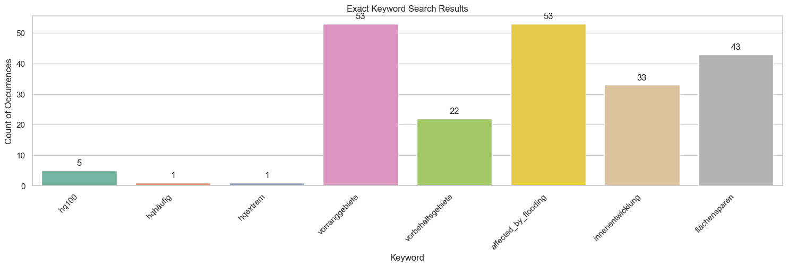

.. figure:: assets/dssg_banner.png
   :alt: dssg_banner

Execution Pipeline
==================

.. code:: ipython3

    import pandas as pd
    import os
    import json
    
    from data_pipeline.match_RPlan_BPlan.matching_plans import merge_rp_bp
    from data_pipeline.match_RPlan_BPlan.matching_plans import export_merged_bp_rp
    from data_pipeline.nrw_pdf_downloader.geojson_parser import parse_geojson
    from data_pipeline.nrw_pdf_downloader.nrw_pdf_scraper import run_pdf_downloader
    from data_pipeline.pdf_scraper.tika_pdf_scraper import pdf_parser_from_folder
    from features.textual_features.document_texts_creation.create_document_texts import enrich_extracts_with_metadata
    from features.textual_features.keyword_search.exact_keyword_search import search_df_for_keywords
    from features.textual_features.keyword_search.contextual_fuzzy_search import search_best_matches_dict
    
    from data_pipeline.rplan_content_extraction.rplan_utils import extract_text_and_save_to_txt_files
    from data_pipeline.rplan_content_extraction.rplan_content_extractor import parse_rplan_directory
    from data_pipeline.rplan_content_extraction.rplan_utils import parse_result_df
    from data_pipeline.rplan_content_extraction.rplan_keyword_search import rplan_exact_keyword_search
    from visualizations.rplan_visualization import plot_keyword_search_results

.. code:: ipython3

    INPUT_BP_FILE_PATH = '../data/nrw/bplan/raw/links/NRW_BP.geojson'
    INPUT_REGIONS_FILE_PATH = '../data/nrw/rplan/raw/geo/regions_map.geojson'
    
    BP_PDF_DIR = '../data/nrw/bplan/raw/pdfs'
    BP_CSV_FILE_PATH = '../data/nrw/bplan/raw/links/NRW_BP_parsed_links.csv'
    LAND_PARCELS_FILE_PATH = '../data/nrw/bplan/raw/links/land_parcels.geojson'
    
    BP_TEXT_FILE_PATH_JSON = '../data/nrw/bplan/raw/text/bp_text.json' 
    
    RPLAN_PDF_DIR = "../data/nrw/rplan/raw/pdfs"
    RPLAN_TXT_DIR = "../data/nrw/rplan/raw/text"
    RPLAN_OUTPUT_PATH = "../data/nrw/rplan/features/regional_plan_sections.json"
    RPLAN_KEYWORDS_PATH = "../data/nrw/rplan/features/rplan_keywords.json"
    
    DOCUMENT_TEXT_FILE_PATH_JSON = '../data/nrw/bplan/raw/text/document_texts.json'
    
    EXACT_KEYWORD_DICT_FILEPATHS = {
        'features/textual_features/keyword_search/keyword_dict_baunvo.json':
        '../data/nrw/bplan/features/keywords/exact_search/baunvo_keywords.csv'
        }
    """key: keyword dict path, value: output csv path"""
    
    HOCHWASSER_KEYWORD_DICT_FILEPATH = 'features/textual_features/keyword_search/keyword_dict_hochwasser.json'
    HOCHWASSER_FUZZY_SEARCH_FILE_PATH_CSV = '../data/nrw/bplan/features/keywords/fuzzy_search/keyword_dict_hochwasser.csv'
    HOCHWASSER_FUZZY_SEARCH_FILE_PATH_JSON = '../data/nrw/bplan/features/keywords/fuzzy_search/keyword_dict_hochwasser.json'
    
    DOCUMENT_ID_COLUMN='filename'
    TEXT_COLUMN='content'
    METADATA_COLUMNS = 'metadata'

Step 1: Scrape building plans from NRW geoportal
------------------------------------------------

The basis for this scrape is a data set with links to building plans in
pdf format (``scanurl``) and further metadata per building plan provided
in the `NRW geoportal <https://www.geoportal.nrw/?activetab=map>`__,
also made available in this repository
(``'../data/nrw/bplan/raw/links/NRW_BP.geojson'``). The information from
this file is parsed, relevant links and further information are
extracted and the PDF files are then downloaded.

.. code:: ipython3

    # Parse geojson
    parsed_geojson = parse_geojson(file_path=INPUT_BP_FILE_PATH,
                                   output_path = BP_CSV_FILE_PATH)

.. code:: ipython3

    parsed_geojson = pd.read_csv(BP_CSV_FILE_PATH)
    print(parsed_geojson.shape)
    # Run downloader
    run_pdf_downloader(input_df=parsed_geojson,
                       output_folder=BP_PDF_DIR)

To create the data table ``land_parcels``, we add columns that refer to
the regional plan corresponding to each development plan. It takes as
input the same geojson (``INPUT_BP_FILE_PATH)`` we were working with
before, but also the file that contains geodata of the regions (provided
by GreenDIA and also in this repository).

.. code:: ipython3

    land_parcels = merge_rp_bp(INPUT_BP_FILE_PATH, INPUT_REGIONS_FILE_PATH)

.. code:: ipython3

    export_merged_bp_rp(LAND_PARCELS_FILE_PATH, INPUT_BP_FILE_PATH, INPUT_REGIONS_FILE_PATH)

.. code:: ipython3

    # Clearing memory before new executions
    del parsed_geojson
    del land_parcels

Step 2: Extract text from PDFs
------------------------------

In which we apply OCR to extract the text from each document scraped
from the NRW building plan portal.

.. code:: ipython3

    parsed_pdfs_df = pdf_parser_from_folder(folder_path=BP_PDF_DIR)
    
    parsed_pdfs_json = parsed_pdfs_df.to_json(orient='records')
    
    with open(BP_TEXT_FILE_PATH_JSON, 'w') as outputfile:
        outputfile.write(parsed_pdfs_json)

.. code:: ipython3

    del parsed_pdfs_df
    del parsed_pdfs_json

Step 3: Enrich extracted building plan texts with information about corresponding land parcels
----------------------------------------------------------------------------------------------

To ultimately create the data table ``document_texts``

.. code:: ipython3

    bplans_info = pd.read_csv(BP_CSV_FILE_PATH, dtype='unicode')
    bplans_text = pd.read_json(BP_TEXT_FILE_PATH_JSON)
    
    result_df = enrich_extracts_with_metadata(info_df=bplans_info,
                                              text_df=bplans_text)

.. code:: ipython3

    bp_parsed_links = pd.read_csv('../data/nrw/bplan/raw/links/NRW_BP_parsed_links.csv')

.. code:: ipython3

    bplans_info['plantyp'].unique()

.. code:: ipython3

    # write results to json
    result_json = result_df.to_json(orient='records')
    with open(DOCUMENT_TEXT_FILE_PATH_JSON, 'w') as outputfile:
        outputfile.write(result_json)

.. code:: ipython3

    # Clearing memory
    del result_df

Step 4: Perform an exact keyword search in extracted texts
----------------------------------------------------------

.. code:: ipython3

    # read in data
    bp_text_df = pd.read_json(BP_TEXT_FILE_PATH_JSON)

.. code:: ipython3

    
    for keyword_dict_file_path in EXACT_KEYWORD_DICT_FILEPATHS.keys():
        with open(keyword_dict_file_path) as f:
            keywords_dict= json.load(f) 
            
        result_df = search_df_for_keywords(input_df=bp_text_df,
                                       text_column_name=TEXT_COLUMN,
                                       id_column_name=DOCUMENT_ID_COLUMN,
                                       keyword_dict=keywords_dict)
        
        result_df.to_csv(EXACT_KEYWORD_DICT_FILEPATHS[keyword_dict_file_path], header=True, index=False)

.. code:: ipython3

    del result_df

Step 5: Perform an fuzzy keyword search in extracted texts
----------------------------------------------------------

.. code:: ipython3

    ! python features/textual_features/keyword_search/contextual_fuzzy_search_parallelised.py

.. code:: ipython3

    with open(HOCHWASSER_KEYWORD_DICT_FILEPATH) as f:
        HOCHWASSER_KEYWORDS = json.load(f)
    threshold=85
    context_words=15
    all_matches = search_best_matches_dict(input_df=bp_text_df,
                                             id_column_name=DOCUMENT_ID_COLUMN,
                                             text_column_name=TEXT_COLUMN,
                                             keyword_dict=HOCHWASSER_KEYWORDS,
                                             threshold=threshold,
                                             context_words=context_words)

.. code:: ipython3

    all_matches

.. code:: ipython3

    all_matches_json = all_matches.to_json(orient='records')
    with open(HOCHWASSER_FUZZY_SEARCH_FILE_PATH_JSON, 'w') as outputfile:
        outputfile.write(all_matches_json)

Step 6: Extract content from regional plans
-------------------------------------------

To extract content from regional plans, i.e. parse the text from the
pdfs and divide them into chapters / sections. This yields the
``regional_plan_sections`` dataset.

.. code:: ipython3

    extract_text_and_save_to_txt_files(pdf_dir_path=RPLAN_PDF_DIR,
                                       txt_dir_path=RPLAN_TXT_DIR)
    
    input_df = parse_rplan_directory(txt_dir_path=RPLAN_TXT_DIR,
                                     json_output_path=RPLAN_OUTPUT_PATH)
    
    input_df = parse_result_df(df=input_df)
    # save to json
    input_df.to_json(RPLAN_OUTPUT_PATH)

.. parsed-literal::

    2023-09-25 19:39:11.052 | DEBUG    | data_pipeline.rplan_content_extraction.rplan_content_extractor:parse_rplan_directory:341 - ../data/nrw/rplan/raw/text/muenster-2004.txt
    2023-09-25 19:39:11.053 | DEBUG    | data_pipeline.rplan_content_extraction.rplan_content_extractor:parse_rplan_directory:343 - Processing file ../data/nrw/rplan/raw/text/muenster-2004.txt
    2023-09-25 19:39:11.466 | DEBUG    | data_pipeline.rplan_content_extraction.rplan_content_extractor:parse_rplan_directory:341 - ../data/nrw/rplan/raw/text/bielefeld-_.txt
    2023-09-25 19:39:11.467 | DEBUG    | data_pipeline.rplan_content_extraction.rplan_content_extractor:parse_rplan_directory:343 - Processing file ../data/nrw/rplan/raw/text/bielefeld-_.txt
    2023-09-25 19:39:11.681 | DEBUG    | data_pipeline.rplan_content_extraction.rplan_content_extractor:parse_rplan_directory:341 - ../data/nrw/rplan/raw/text/arnsberg-2008-siegen.txt
    2023-09-25 19:39:11.681 | DEBUG    | data_pipeline.rplan_content_extraction.rplan_content_extractor:parse_rplan_directory:343 - Processing file ../data/nrw/rplan/raw/text/arnsberg-2008-siegen.txt
    2023-09-25 19:39:11.853 | DEBUG    | data_pipeline.rplan_content_extraction.rplan_content_extractor:parse_rplan_directory:341 - ../data/nrw/rplan/raw/text/duesseldorf-2018.txt
    2023-09-25 19:39:11.854 | DEBUG    | data_pipeline.rplan_content_extraction.rplan_content_extractor:parse_rplan_directory:343 - Processing file ../data/nrw/rplan/raw/text/duesseldorf-2018.txt
    2023-09-25 19:39:13.070 | DEBUG    | data_pipeline.rplan_content_extraction.rplan_content_extractor:parse_rplan_directory:341 - ../data/nrw/rplan/raw/text/bonn-2009.txt
    2023-09-25 19:39:13.071 | DEBUG    | data_pipeline.rplan_content_extraction.rplan_content_extractor:parse_rplan_directory:343 - Processing file ../data/nrw/rplan/raw/text/bonn-2009.txt
    2023-09-25 19:39:13.099 | DEBUG    | data_pipeline.rplan_content_extraction.rplan_content_extractor:parse_rplan_directory:341 - ../data/nrw/rplan/raw/text/detmold-2007-paderborn_hoexter.txt
    2023-09-25 19:39:13.100 | DEBUG    | data_pipeline.rplan_content_extraction.rplan_content_extractor:parse_rplan_directory:343 - Processing file ../data/nrw/rplan/raw/text/detmold-2007-paderborn_hoexter.txt
    2023-09-25 19:39:13.414 | DEBUG    | data_pipeline.rplan_content_extraction.rplan_content_extractor:parse_rplan_directory:341 - ../data/nrw/rplan/raw/text/köln-2006.txt
    2023-09-25 19:39:13.415 | DEBUG    | data_pipeline.rplan_content_extraction.rplan_content_extractor:parse_rplan_directory:343 - Processing file ../data/nrw/rplan/raw/text/köln-2006.txt
    2023-09-25 19:39:13.420 | DEBUG    | data_pipeline.rplan_content_extraction.rplan_content_extractor:parse_rplan_directory:341 - ../data/nrw/rplan/raw/text/arnsberg-2012-kreis_soest_hochsauerlandkreis.txt
    2023-09-25 19:39:13.421 | DEBUG    | data_pipeline.rplan_content_extraction.rplan_content_extractor:parse_rplan_directory:343 - Processing file ../data/nrw/rplan/raw/text/arnsberg-2012-kreis_soest_hochsauerlandkreis.txt
    2023-09-25 19:39:13.881 | DEBUG    | data_pipeline.rplan_content_extraction.rplan_content_extractor:parse_rplan_directory:341 - ../data/nrw/rplan/raw/text/arnsberg-2001-bochum_hagen.txt
    2023-09-25 19:39:13.882 | DEBUG    | data_pipeline.rplan_content_extraction.rplan_content_extractor:parse_rplan_directory:343 - Processing file ../data/nrw/rplan/raw/text/arnsberg-2001-bochum_hagen.txt
    2023-09-25 19:39:14.130 | DEBUG    | data_pipeline.rplan_content_extraction.rplan_content_extractor:parse_rplan_directory:341 - ../data/nrw/rplan/raw/text/arnsberg-2004-dortmund_unna_hamm.txt
    2023-09-25 19:39:14.130 | DEBUG    | data_pipeline.rplan_content_extraction.rplan_content_extractor:parse_rplan_directory:343 - Processing file ../data/nrw/rplan/raw/text/arnsberg-2004-dortmund_unna_hamm.txt
    2023-09-25 19:39:14.305 | DEBUG    | data_pipeline.rplan_content_extraction.rplan_content_extractor:parse_rplan_directory:341 - ../data/nrw/rplan/raw/text/ruhr-2009.txt
    2023-09-25 19:39:14.305 | DEBUG    | data_pipeline.rplan_content_extraction.rplan_content_extractor:parse_rplan_directory:343 - Processing file ../data/nrw/rplan/raw/text/ruhr-2009.txt
    2023-09-25 19:39:15.128 | DEBUG    | data_pipeline.rplan_content_extraction.rplan_content_extractor:parse_rplan_directory:341 - ../data/nrw/rplan/raw/text/aachen-2016.txt
    2023-09-25 19:39:15.128 | DEBUG    | data_pipeline.rplan_content_extraction.rplan_content_extractor:parse_rplan_directory:343 - Processing file ../data/nrw/rplan/raw/text/aachen-2016.txt
    2023-09-25 19:39:15.522 | DEBUG    | data_pipeline.rplan_content_extraction.rplan_content_extractor:parse_rplan_directory:341 - ../data/nrw/rplan/raw/text/kÔÇØln-2006.txt
    2023-09-25 19:39:15.522 | DEBUG    | data_pipeline.rplan_content_extraction.rplan_content_extractor:parse_rplan_directory:343 - Processing file ../data/nrw/rplan/raw/text/kÔÇØln-2006.txt
    2023-09-25 19:39:15.523 | ERROR    | data_pipeline.rplan_content_extraction.rplan_content_extractor:parse_rplan_directory:347 - Skipping file ../data/nrw/rplan/raw/text/kÔÇØln-2006.txt due to error Format for file kÔÇØln-2006 not found, maybe it's not in the config file?
    2023-09-25 19:39:15.523 | DEBUG    | data_pipeline.rplan_content_extraction.rplan_content_extractor:parse_rplan_directory:341 - ../data/nrw/rplan/raw/text/muenster-2014.txt
    2023-09-25 19:39:15.524 | DEBUG    | data_pipeline.rplan_content_extraction.rplan_content_extractor:parse_rplan_directory:343 - Processing file ../data/nrw/rplan/raw/text/muenster-2014.txt
    2023-09-25 19:39:15.811 | DEBUG    | data_pipeline.rplan_content_extraction.rplan_content_extractor:parse_rplan_directory:341 - ../data/nrw/rplan/raw/text/ruhr-2021.txt
    2023-09-25 19:39:15.811 | DEBUG    | data_pipeline.rplan_content_extraction.rplan_content_extractor:parse_rplan_directory:343 - Processing file ../data/nrw/rplan/raw/text/ruhr-2021.txt
    2023-09-25 19:39:15.855 | INFO     | data_pipeline.rplan_content_extraction.rplan_content_extractor:parse_rplan_directory:357 - Parsing done. Saved to ../data/nrw/rplan/features/regional_plan_sections.json

Step 7: Perform an exact keyword search in extracted texts of regional plans
----------------------------------------------------------------------------

.. code:: ipython3

    exact_result,exact_keywords = rplan_exact_keyword_search(input_df=input_df, save_path=RPLAN_KEYWORDS_PATH)

.. code:: ipython3

    plot_keyword_search_results(result_df=exact_result,
                                keyword_columns=exact_keywords,
                                title="Exact Keyword Search Results")

.. code:: ipython3

    del input_df, exact_result, exact_keywords

Conclusion
----------

This notebook provides the code to execute the pipeline which populates
the land sealing dataset. Further work is done by
‘knowledge_agent.ipynb’ which produces data using ChatGPT. Note that
this shall require a ChatGPT API key of your own.

The ‘explorer.ipynb’ demonstrates functions which display and explore
the complete data set.

