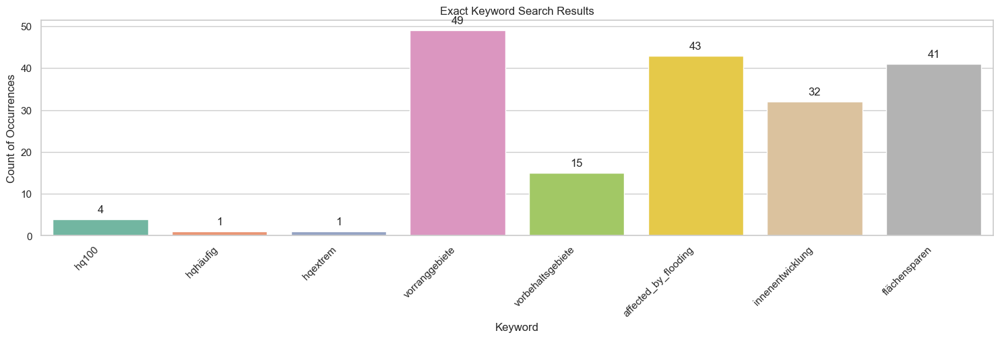
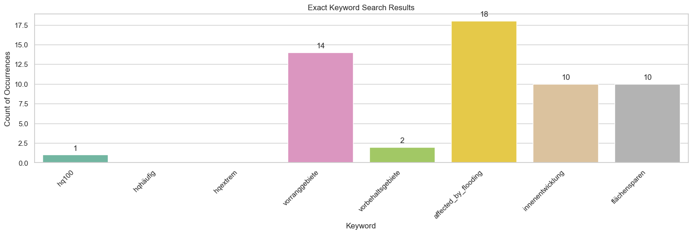
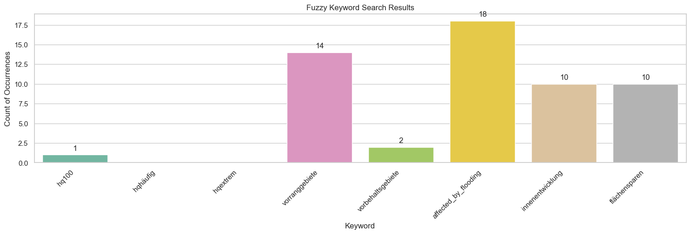

.. figure:: assets/dssg_banner.png
   :alt: dssg_banner

.. code:: ipython3

    # Import the data generation functions
    from data_pipeline.rplan_content_extraction.rplan_utils import extract_text_and_save_to_txt_files
    from data_pipeline.rplan_content_extraction.rplan_content_extractor import parse_rplan_directory
    from data_pipeline.rplan_content_extraction.rplan_utils import parse_result_df
    
    # Import the keyword search functions
    from data_pipeline.rplan_content_extraction.rplan_keyword_search import negate_keyword_search, rplan_exact_keyword_search
    # Import the visualization function
    from visualizations.rplan_visualization import plot_keyword_search_results
    
    # Import the paths to the keyword dictionaries and the content data
    from data_pipeline.rplan_content_extraction.rplan_keyword_search import rplan_negate_keyword_dict_path

Keyword Negation
================

This notebook gives an overview how to use the negation keyword search
to remove false positives from the results of a keyword search. To
illustrate, the keyword search of ``2_8_regional_plans_demo`` is first
repeated (Step 1 & 2) and then extended (Step 3-5).

.. code:: ipython3

    # Set the paths to the PDF and TXT directories
    RPLAN_PDF_DIR = "../data/nrw/rplan/raw/pdfs"
    RPLAN_TXT_DIR = "../data/nrw/rplan/raw/text"
    RPLAN_OUTPUT_PATH = "../data/nrw/rplan/features/rplan_content.json"

Step 1: Generate content
------------------------

.. code:: ipython3

    extract_text_and_save_to_txt_files(pdf_dir_path=RPLAN_PDF_DIR,
                                       txt_dir_path=RPLAN_TXT_DIR)
    
    input_df = parse_rplan_directory(txt_dir_path=RPLAN_TXT_DIR,
                                     json_output_path=RPLAN_OUTPUT_PATH)
    
    input_df = parse_result_df(df=input_df)
    
    # save df as JSON
    input_df.to_json(RPLAN_OUTPUT_PATH)

.. parsed-literal::

    2023-09-21 14:47:24.002 | INFO     | data_pipeline.pdf_scraper.tika_pdf_scraper:pdf_parser_from_folder:63 - Parsing file: arnsberg-2001-bochum_hagen.pdf
    2023-09-21 14:47:25.241 | INFO     | data_pipeline.pdf_scraper.tika_pdf_scraper:pdf_parser_from_folder:63 - Parsing file: arnsberg-2004-dortmund_unna_hamm.pdf
    2023-09-21 14:47:27.248 | INFO     | data_pipeline.pdf_scraper.tika_pdf_scraper:pdf_parser_from_folder:63 - Parsing file: arnsberg-2008-siegen.pdf
    2023-09-21 14:47:27.738 | INFO     | data_pipeline.pdf_scraper.tika_pdf_scraper:pdf_parser_from_folder:63 - Parsing file: arnsberg-2012-kreis_soest_hochsauerlandkreis.pdf
    2023-09-21 14:47:28.388 | INFO     | data_pipeline.pdf_scraper.tika_pdf_scraper:pdf_parser_from_folder:63 - Parsing file: bielefeld-_.pdf
    2023-09-21 14:47:28.676 | INFO     | data_pipeline.pdf_scraper.tika_pdf_scraper:pdf_parser_from_folder:63 - Parsing file: detmold-2007-paderborn_hoexter.pdf
    2023-09-21 14:47:29.524 | INFO     | data_pipeline.pdf_scraper.tika_pdf_scraper:pdf_parser_from_folder:63 - Parsing file: duesseldorf-2018.pdf
    2023-09-21 14:47:30.876 | INFO     | data_pipeline.pdf_scraper.tika_pdf_scraper:pdf_parser_from_folder:63 - Parsing file: kÔÇØln-2006.pdf
    2023-09-21 14:47:30.936 | INFO     | data_pipeline.pdf_scraper.tika_pdf_scraper:pdf_parser_from_folder:63 - Parsing file: muenster-2004.pdf
    2023-09-21 14:47:31.486 | INFO     | data_pipeline.pdf_scraper.tika_pdf_scraper:pdf_parser_from_folder:63 - Parsing file: muenster-2014.pdf
    2023-09-21 14:47:32.996 | INFO     | data_pipeline.pdf_scraper.tika_pdf_scraper:pdf_parser_from_folder:63 - Parsing file: ruhr-2009.pdf
    2023-09-21 14:47:33.460 | INFO     | data_pipeline.pdf_scraper.tika_pdf_scraper:pdf_parser_from_folder:63 - Parsing file: ruhr-2021.pdf
    2023-09-21 14:47:33.671 | INFO     | data_pipeline.pdf_scraper.tika_pdf_scraper:pdf_parser_from_folder:74 - Parsing done.
    2023-09-21 14:47:33.734 | DEBUG    | data_pipeline.rplan_content_extraction.rplan_content_extractor:parse_rplan_directory:341 - ../data/nrw/rplan/raw/text\arnsberg-2001-bochum_hagen.txt
    2023-09-21 14:47:33.736 | DEBUG    | data_pipeline.rplan_content_extraction.rplan_content_extractor:parse_rplan_directory:343 - Processing file ../data/nrw/rplan/raw/text\arnsberg-2001-bochum_hagen.txt
    2023-09-21 14:47:34.165 | DEBUG    | data_pipeline.rplan_content_extraction.rplan_content_extractor:parse_rplan_directory:341 - ../data/nrw/rplan/raw/text\arnsberg-2004-dortmund_unna_hamm.txt
    2023-09-21 14:47:34.165 | DEBUG    | data_pipeline.rplan_content_extraction.rplan_content_extractor:parse_rplan_directory:343 - Processing file ../data/nrw/rplan/raw/text\arnsberg-2004-dortmund_unna_hamm.txt
    2023-09-21 14:47:34.448 | DEBUG    | data_pipeline.rplan_content_extraction.rplan_content_extractor:parse_rplan_directory:341 - ../data/nrw/rplan/raw/text\arnsberg-2008-siegen.txt
    2023-09-21 14:47:34.450 | DEBUG    | data_pipeline.rplan_content_extraction.rplan_content_extractor:parse_rplan_directory:343 - Processing file ../data/nrw/rplan/raw/text\arnsberg-2008-siegen.txt
    2023-09-21 14:47:34.723 | DEBUG    | data_pipeline.rplan_content_extraction.rplan_content_extractor:parse_rplan_directory:341 - ../data/nrw/rplan/raw/text\arnsberg-2012-kreis_soest_hochsauerlandkreis.txt
    2023-09-21 14:47:34.725 | DEBUG    | data_pipeline.rplan_content_extraction.rplan_content_extractor:parse_rplan_directory:343 - Processing file ../data/nrw/rplan/raw/text\arnsberg-2012-kreis_soest_hochsauerlandkreis.txt
    2023-09-21 14:47:35.283 | DEBUG    | data_pipeline.rplan_content_extraction.rplan_content_extractor:parse_rplan_directory:341 - ../data/nrw/rplan/raw/text\bielefeld-_.txt
    2023-09-21 14:47:35.286 | DEBUG    | data_pipeline.rplan_content_extraction.rplan_content_extractor:parse_rplan_directory:343 - Processing file ../data/nrw/rplan/raw/text\bielefeld-_.txt
    2023-09-21 14:47:35.605 | DEBUG    | data_pipeline.rplan_content_extraction.rplan_content_extractor:parse_rplan_directory:341 - ../data/nrw/rplan/raw/text\detmold-2007-paderborn_hoexter.txt
    2023-09-21 14:47:35.608 | DEBUG    | data_pipeline.rplan_content_extraction.rplan_content_extractor:parse_rplan_directory:343 - Processing file ../data/nrw/rplan/raw/text\detmold-2007-paderborn_hoexter.txt
    2023-09-21 14:47:36.024 | DEBUG    | data_pipeline.rplan_content_extraction.rplan_content_extractor:parse_rplan_directory:341 - ../data/nrw/rplan/raw/text\duesseldorf-2018.txt
    2023-09-21 14:47:36.025 | DEBUG    | data_pipeline.rplan_content_extraction.rplan_content_extractor:parse_rplan_directory:343 - Processing file ../data/nrw/rplan/raw/text\duesseldorf-2018.txt
    2023-09-21 14:47:37.569 | DEBUG    | data_pipeline.rplan_content_extraction.rplan_content_extractor:parse_rplan_directory:341 - ../data/nrw/rplan/raw/text\kÔÇØln-2006.txt
    2023-09-21 14:47:37.571 | DEBUG    | data_pipeline.rplan_content_extraction.rplan_content_extractor:parse_rplan_directory:343 - Processing file ../data/nrw/rplan/raw/text\kÔÇØln-2006.txt
    2023-09-21 14:47:37.582 | ERROR    | data_pipeline.rplan_content_extraction.rplan_content_extractor:parse_rplan_directory:347 - Skipping file ../data/nrw/rplan/raw/text\kÔÇØln-2006.txt due to error Format for file kÔÇØln-2006 not found, maybe it's not in the config file?
    2023-09-21 14:47:37.582 | DEBUG    | data_pipeline.rplan_content_extraction.rplan_content_extractor:parse_rplan_directory:341 - ../data/nrw/rplan/raw/text\muenster-2004.txt
    2023-09-21 14:47:37.583 | DEBUG    | data_pipeline.rplan_content_extraction.rplan_content_extractor:parse_rplan_directory:343 - Processing file ../data/nrw/rplan/raw/text\muenster-2004.txt
    2023-09-21 14:47:38.040 | DEBUG    | data_pipeline.rplan_content_extraction.rplan_content_extractor:parse_rplan_directory:341 - ../data/nrw/rplan/raw/text\muenster-2014.txt
    2023-09-21 14:47:38.041 | DEBUG    | data_pipeline.rplan_content_extraction.rplan_content_extractor:parse_rplan_directory:343 - Processing file ../data/nrw/rplan/raw/text\muenster-2014.txt
    2023-09-21 14:47:38.403 | DEBUG    | data_pipeline.rplan_content_extraction.rplan_content_extractor:parse_rplan_directory:341 - ../data/nrw/rplan/raw/text\ruhr-2009.txt
    2023-09-21 14:47:38.405 | DEBUG    | data_pipeline.rplan_content_extraction.rplan_content_extractor:parse_rplan_directory:343 - Processing file ../data/nrw/rplan/raw/text\ruhr-2009.txt
    2023-09-21 14:47:39.478 | DEBUG    | data_pipeline.rplan_content_extraction.rplan_content_extractor:parse_rplan_directory:341 - ../data/nrw/rplan/raw/text\ruhr-2021.txt
    2023-09-21 14:47:39.480 | DEBUG    | data_pipeline.rplan_content_extraction.rplan_content_extractor:parse_rplan_directory:343 - Processing file ../data/nrw/rplan/raw/text\ruhr-2021.txt
    2023-09-21 14:47:39.535 | INFO     | data_pipeline.rplan_content_extraction.rplan_content_extractor:parse_rplan_directory:357 - Parsing done. Saved to ../data/nrw/rplan/features/rplan_content.json

Step 2: Exact keyword search
----------------------------

Now we perform an exact keyword search on the data and plot the results.

.. code:: ipython3

    exact_result, exact_keywords = rplan_exact_keyword_search(input_df=input_df)
    
    plot_keyword_search_results(result_df=exact_result,
                                keyword_columns=exact_keywords,
                                title="Exact Keyword Search Results")

Step 3: Negate keyword search
-----------------------------

Now we want to compare the results of the exact keyword search with the
results of the negate keyword search. So first we remove the negation
keywords from the content data. Then we do another exact keyword search
on the data without the negation keywords.

The negation keywords are defined in the file at
``rplan_negate_keyword_dict_path``. The file contains a list with the
following structure:

::

       `['naturschutz', 'natur', 'umwelt', 'umweltschutz']`

This is an exemplary usage, to remove keywords containing the topic
``"naturschutz"`` from the content data.

.. code:: ipython3

    input_df = negate_keyword_search(input_df=input_df,
                                     negate_keyword_dict_path=rplan_negate_keyword_dict_path)

.. parsed-literal::

    2023-09-21 14:48:02.687 | INFO     | data_pipeline.rplan_content_extraction.rplan_keyword_search:negate_keyword_search:135 - Negate keywords: ['naturschutz', 'natur', 'umwelt', 'umweltschutz']
    2023-09-21 14:48:03.664 | INFO     | data_pipeline.rplan_content_extraction.rplan_keyword_search:negate_keyword_search:143 - Removed 614 rows with negate keywords

.. code:: ipython3

    exact_result, exact_keywords = rplan_exact_keyword_search(input_df=input_df)
    
    plot_keyword_search_results(result_df=exact_result,
                                keyword_columns=exact_keywords,
                                title="Exact Keyword Search Results")

Step 4: Compare the results
---------------------------

We see that the number of matches for has decreased. For instance, the
number of matches for the keyword “Vorranggebiet” has decreased from 55
to 18.

Step 5: Fuzzy Keyword Search
----------------------------

Now we want to perform a fuzzy keyword search on the data. We can use
the results of the negate keyword search as input for the fuzzy keyword
search.

.. code:: ipython3

    fuzzy_result, fuzzy_keywords = rplan_exact_keyword_search(input_df=input_df)
    
    plot_keyword_search_results(result_df=fuzzy_result,
                                keyword_columns=fuzzy_keywords,
                                title="Fuzzy Keyword Search Results")

