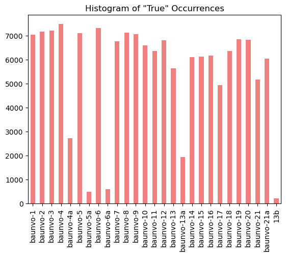
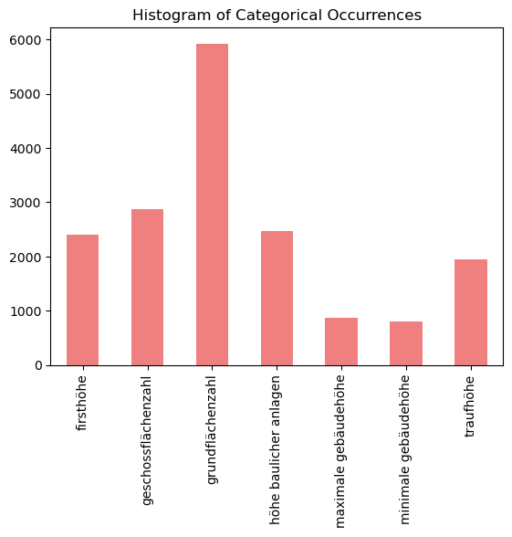
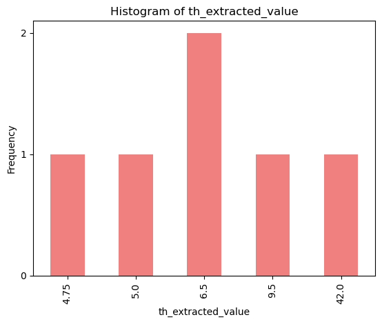
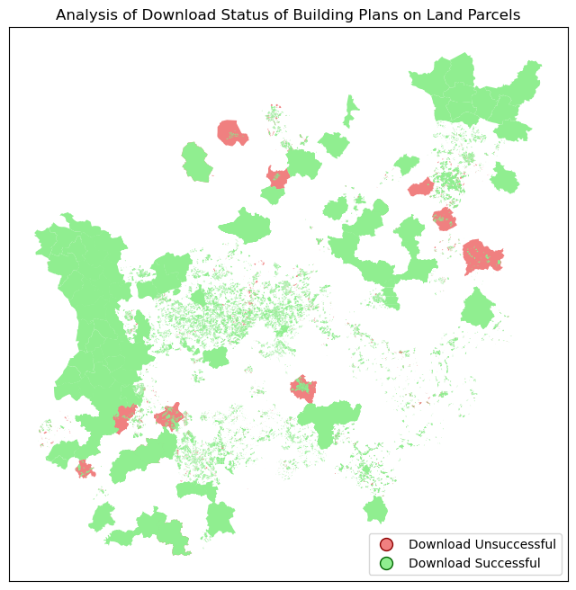
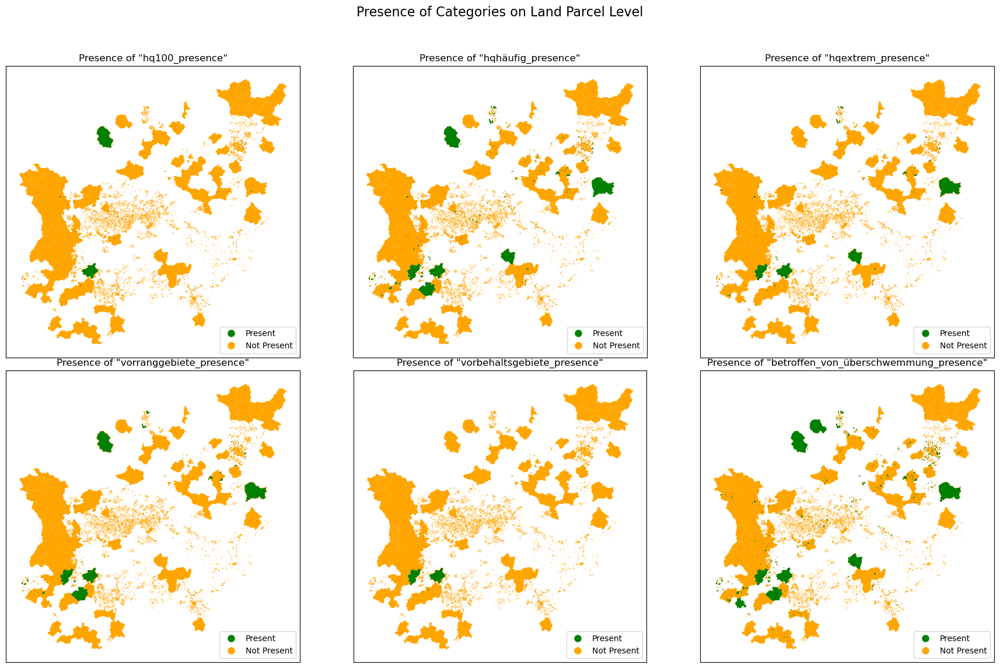
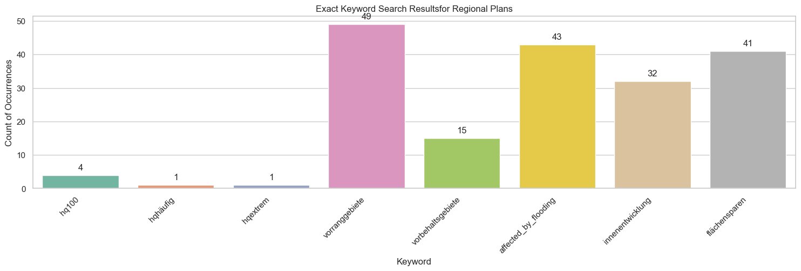

.. figure:: assets/dssg_banner.png
   :alt: dssg_banner

Exploring the Land Sealing Application Dataset
==============================================

This project executes a pipeline which yields a complex dataset
regarding land sealing applications across Germany. This notebook is
intended to help users understand how to extract the final forms of
these datasets and apply analysis.

--------------

Getting Started
---------------

Setup Colab environment
^^^^^^^^^^^^^^^^^^^^^^^

If you installed the packages and requirments on your own machine, you
can skip this section and start from the import section. Otherwise you
can follow and execute the tutorial on your browser. In order to start
working on the notebook, click on the following button, this will open
this page in the Colab environment and you will be able to execute the
code on your own.

|Open In Colab|

Now that you are visualizing the notebook in Colab, uncomment and run
the next cells to install the packages we will use and set up your
collab environment. There are few things you should follow in order to
properly set the notebook up: 1. Warning: This notebook was not authored
by Google. Click on ‘Run anyway’. 2. When the installation commands are
done, there might be “Restart runtime” button at the end of the output.
Please, click it.

.. |Open In Colab| image:: https://colab.research.google.com/assets/colab-badge.svg
   :target: https://colab.research.google.com/github/DSSGxMunich/dssgx_land_sealing_dataset_analysis/blob/main/explorer.ipynb

.. code:: ipython3

    # %pip install pandas
    # %pip install geopandas

By running the next cell you are going to create a folder in your Google
Drive. All the files for this tutorial will be uploaded to this folder.
After the first execution you might receive some warning and
notification, please follow these instructions: 1. Permit this notebook
to access your Google Drive files? Click on ‘Yes’, and select your
account. 2. Google Drive for desktop wants to access your Google
Account. Click on ‘Allow’.

At this point, a folder has been created and you can navigate it through
the lefthand panel in Colab, you might also have received an email that
informs you about the access on your Google Drive.

.. code:: ipython3

    # Create a folder in your Google Drive
    # from google.colab import drive                                                                          
    # drive.mount('/content/drive')

.. code:: ipython3

    # Don't run this cell if you already cloned the repo 
    # !git clone https://github.com/DSSGxMunich/land-sealing-dataset-and-analysis.git

.. code:: ipython3

    # %cd land-sealing-dataset-and-analysis

Imports
-------

.. code:: ipython3

    import pandas as pd ## a common datatable manipulation library
    import geopandas as gpd ## an extension of pandas fo the geojson filetype
    import os ## used for loading and saving files
    import sys ## Used for handling imports
    import matplotlib.pyplot as plt ## visualizations
    
    sys.path.insert(0, './src') ## helps with imports in our file structure
    from explorers.explorer import * ## functions that yield datasets
    from data_pipeline.rplan_content_extraction.rplan_keyword_search import rplan_exact_keyword_search
    from visualizations.rplan_visualization import plot_keyword_search_results

Introducing the Dataset Tables
------------------------------

The explorer module offers a seamless solution for accessing
pre-processed and cleaned datasets designed for in-depth analysis. These
dataset tables are the result of a comprehensive pipeline which are
documented in the official documentation [insert link to documentation].

This process produces a range of data tables that encompass information
on land parcels, local land use, regional plans, as well as crucial
keywords and context extracted from each dataset table. [link to Hugging
Face dataset documentation].

Within the explorer notebook,these dataset tables provide a
straightforward entry point for your analytical endeavors. Whether
you’re a seasoned data scientist or just starting out, the explorer
module equips you with the essential tools to dive right into your
analysis with ease.

Land Parcels
~~~~~~~~~~~~

Every row represents a unique land parcel, with its associated document
text stored in the document_text table. This dataset also includes
information specific to these land parcels, including their boundaries’
geometry, name, and ID. It’s important to note that the data we’ve
collected is limited to the state of North Rhine-Westphalia (NRW).

.. code:: ipython3

    lp = land_parcels()
    lp.to_excel('data/nrw/clean/land_parcels.xlsx')
    print("This table contains", len(lp), "land parcels")
    lp.head(5)

.. parsed-literal::

    This table contains 55836 land parcels

.. raw:: html

    

    
    <table border="1" class="dataframe">
      <thead>
        <tr style="text-align: right;">
          <th></th>
          <th>Land Parcel ID</th>
          <th>planid</th>
          <th>levelplan</th>
          <th>name</th>
          <th>kommune</th>
          <th>gkz</th>
          <th>nr</th>
          <th>besch</th>
          <th>aend</th>
          <th>aendert</th>
          <th>...</th>
          <th>begruendurl</th>
          <th>umweltberurl</th>
          <th>erklaerungurl</th>
          <th>shape_Length</th>
          <th>shape_Area</th>
          <th>Region Plan ID</th>
          <th>regional_plan_name</th>
          <th>ART</th>
          <th>LND</th>
          <th>geometry</th>
        </tr>
      </thead>
      <tbody>
        <tr>
          <th>0</th>
          <td>84060</td>
          <td>DE_05382060_Siegburg_BP93/1</td>
          <td>infra-local</td>
          <td>Im Klausgarten, Braschosser Straße, Am Kreuztor</td>
          <td>Siegburg</td>
          <td>05382060</td>
          <td>93/1</td>
          <td>NaN</td>
          <td>NaN</td>
          <td>NaN</td>
          <td>...</td>
          <td>NaN</td>
          <td>NaN</td>
          <td>NaN</td>
          <td>868.647801</td>
          <td>3.196032e+04</td>
          <td>5022</td>
          <td>Region Bonn/Rhein-Sieg</td>
          <td>Teilabschnitt</td>
          <td>5</td>
          <td>POLYGON ((7.28543 50.82280, 7.28728 50.82179, ...</td>
        </tr>
        <tr>
          <th>1</th>
          <td>559438</td>
          <td>DE_05382036_02_32</td>
          <td>infra-local</td>
          <td>32. Änderung des Bebauungsplanes Nr. 2 „Much-K...</td>
          <td>Much</td>
          <td>05382036</td>
          <td>0</td>
          <td>NaN</td>
          <td>32.  Änderung</td>
          <td>NaN</td>
          <td>...</td>
          <td>https://www.much.de/zukunft/bauleitplanungen</td>
          <td>https://www.much.de/zukunft/bauleitplanungen</td>
          <td>NaN</td>
          <td>473.229327</td>
          <td>4.467916e+03</td>
          <td>5022</td>
          <td>Region Bonn/Rhein-Sieg</td>
          <td>Teilabschnitt</td>
          <td>5</td>
          <td>POLYGON ((7.39385 50.90281, 7.39416 50.90240, ...</td>
        </tr>
        <tr>
          <th>2</th>
          <td>2257588</td>
          <td>DE_05314000_00</td>
          <td>local</td>
          <td>Flächennutzungsplan der Bundesstadt Bonn</td>
          <td>Bonn</td>
          <td>05314000</td>
          <td>00</td>
          <td></td>
          <td></td>
          <td></td>
          <td>...</td>
          <td>NaN</td>
          <td>NaN</td>
          <td>NaN</td>
          <td>69372.039264</td>
          <td>1.410146e+08</td>
          <td>5022</td>
          <td>Region Bonn/Rhein-Sieg</td>
          <td>Teilabschnitt</td>
          <td>5</td>
          <td>POLYGON ((7.12896 50.77292, 7.12899 50.77292, ...</td>
        </tr>
        <tr>
          <th>3</th>
          <td>2367967</td>
          <td>DE_05378028_9aenderungI_Ur</td>
          <td>local</td>
          <td>9. Änderung §34_Urschrift</td>
          <td>Rösrath</td>
          <td>05378028</td>
          <td>9aenderungI_Ur</td>
          <td>Breide und Durbusch</td>
          <td>Urschrift</td>
          <td></td>
          <td>...</td>
          <td>http://www.roesrath.de/34-9.-aenderung-breide-...</td>
          <td></td>
          <td></td>
          <td>739.659941</td>
          <td>7.348491e+03</td>
          <td>5022</td>
          <td>Region Bonn/Rhein-Sieg</td>
          <td>Teilabschnitt</td>
          <td>5</td>
          <td>MULTIPOLYGON (((7.23255 50.91855, 7.23242 50.9...</td>
        </tr>
        <tr>
          <th>4</th>
          <td>2367975</td>
          <td>DE_05378028_1aenderungundUrschriftI_Ur</td>
          <td>local</td>
          <td>1. Änderung und Urschrift §34_Urschrift</td>
          <td>Rösrath</td>
          <td>05378028</td>
          <td>1aenderungundUrschriftI_Ur</td>
          <td></td>
          <td>Urschrift</td>
          <td></td>
          <td>...</td>
          <td>http://www.roesrath.de/34-urfassung-und-1.-aen...</td>
          <td></td>
          <td></td>
          <td>56630.267941</td>
          <td>6.082747e+06</td>
          <td>5022</td>
          <td>Region Bonn/Rhein-Sieg</td>
          <td>Teilabschnitt</td>
          <td>5</td>
          <td>MULTIPOLYGON (((7.19091 50.88535, 7.19112 50.8...</td>
        </tr>
      </tbody>
    </table>
    
5 rows × 30 columns

    

Document Texts
~~~~~~~~~~~~~~

This is a very large file containing the text blobs of every document
extracted from the land parcel dataset’s scanurl column. Because it is
so large we retrieve on a small amount of it here. The full data can be
found in ``data\document_texts``

.. code:: ipython3

    ## this data table is very large with many text blobs, so for 
    ## efficiency we retrieve on the first 5 rows. 
    dt = document_texts() 
    ## dataset found in data\document_texts
    
    dt.to_excel('data/nrw/clean/document_texts.xlsx')
    print("This table contains", len(dt), "document texts")
    dt.head()

.. parsed-literal::

    This table contains 23130 document texts

.. raw:: html

    

    
    <table border="1" class="dataframe">
      <thead>
        <tr style="text-align: right;">
          <th></th>
          <th>filename</th>
          <th>content</th>
          <th>metadata</th>
          <th>document_id</th>
          <th>Land Parcel ID</th>
          <th>land_parcel_name</th>
          <th>land_parcel_scanurl</th>
          <th>Document Type Code</th>
        </tr>
      </thead>
      <tbody>
        <tr>
          <th>0</th>
          <td>116995_0.pdf</td>
          <td>\n\n\n\n\n\n\n\n\n\n\n\n\n\n\n\n\n\n\n\n\n\n\n...</td>
          <td>{'pdf:unmappedUnicodeCharsPerPage': '0', 'pdf:...</td>
          <td>1169950</td>
          <td>116995</td>
          <td>Lohhäuser Feld im Stadtteil Klein-Erkenschwick</td>
          <td>https://www.o-sp.de/download/oer-erkenschwick/...</td>
          <td>1000.0</td>
        </tr>
        <tr>
          <th>1</th>
          <td>116995_10.pdf</td>
          <td>None</td>
          <td>{'pdf:unmappedUnicodeCharsPerPage': '0', 'pdf:...</td>
          <td>11699510</td>
          <td>116995</td>
          <td>Lohhäuser Feld im Stadtteil Klein-Erkenschwick</td>
          <td>https://www.o-sp.de/download/oer-erkenschwick/...</td>
          <td>1000.0</td>
        </tr>
        <tr>
          <th>2</th>
          <td>116995_2.pdf</td>
          <td>None</td>
          <td>{'pdf:unmappedUnicodeCharsPerPage': '0', 'pdf:...</td>
          <td>1169952</td>
          <td>116995</td>
          <td>Lohhäuser Feld im Stadtteil Klein-Erkenschwick</td>
          <td>https://www.o-sp.de/download/oer-erkenschwick/...</td>
          <td>1000.0</td>
        </tr>
        <tr>
          <th>3</th>
          <td>116995_4.pdf</td>
          <td>\n\n\n\n\n\n\n\n\n\n\n\n\n\n\n\n\n\n\n\n\n\n\n...</td>
          <td>{'pdf:unmappedUnicodeCharsPerPage': ['0', '0',...</td>
          <td>1169954</td>
          <td>116995</td>
          <td>Lohhäuser Feld im Stadtteil Klein-Erkenschwick</td>
          <td>https://www.o-sp.de/download/oer-erkenschwick/...</td>
          <td>1000.0</td>
        </tr>
        <tr>
          <th>4</th>
          <td>116995_6.pdf</td>
          <td>None</td>
          <td>{'pdf:unmappedUnicodeCharsPerPage': '0', 'pdf:...</td>
          <td>1169956</td>
          <td>116995</td>
          <td>Lohhäuser Feld im Stadtteil Klein-Erkenschwick</td>
          <td>https://www.o-sp.de/download/oer-erkenschwick/...</td>
          <td>1000.0</td>
        </tr>
      </tbody>
    </table>
    

Regional Plans
~~~~~~~~~~~~~~

We manually compiled a set of regional plan documents for NRW and
extracted the text and relevant data from these files. Each row is a
regional plan. One region may have multiple regional plan documents.

.. code:: ipython3

    rp = regional_plans()
    rp.to_excel('data/nrw/clean/regional_plans.xlsx')
    rp.head(5)

.. raw:: html

    

    
    <table border="1" class="dataframe">
      <thead>
        <tr style="text-align: right;">
          <th></th>
          <th>filename</th>
          <th>chapter</th>
          <th>section</th>
          <th>section_type</th>
          <th>year</th>
          <th>Region Plan ID</th>
          <th>Name</th>
        </tr>
      </thead>
      <tbody>
        <tr>
          <th>0</th>
          <td>arnsberg-2001-bochum_hagen</td>
          <td>freiraumentwicklung</td>
          <td>\nenergieversorgung\n2.2.4\n2.3\n2.4\n3.1\n3.2...</td>
          <td>start</td>
          <td>2001.0</td>
          <td>5055.0</td>
          <td>Oberbereiche Bochum/Hagen</td>
        </tr>
        <tr>
          <th>1</th>
          <td>arnsberg-2001-bochum_hagen</td>
          <td>freiraum</td>
          <td>erläuterungen\nbegründet und näher beschrieben...</td>
          <td>explanation</td>
          <td>2001.0</td>
          <td>5055.0</td>
          <td>Oberbereiche Bochum/Hagen</td>
        </tr>
        <tr>
          <th>2</th>
          <td>arnsberg-2001-bochum_hagen</td>
          <td>freiraumfunktionen</td>
          <td>ziel 1\n(1) freiraum darf nach den vorgaben de...</td>
          <td>target</td>
          <td>2001.0</td>
          <td>5055.0</td>
          <td>Oberbereiche Bochum/Hagen</td>
        </tr>
        <tr>
          <th>3</th>
          <td>arnsberg-2001-bochum_hagen</td>
          <td>regionales ordnungskonzept und stärkung der in...</td>
          <td>erläuterung:\nder im gebietsentwicklungsplan d...</td>
          <td>explanation</td>
          <td>2001.0</td>
          <td>5055.0</td>
          <td>Oberbereiche Bochum/Hagen</td>
        </tr>
        <tr>
          <th>4</th>
          <td>arnsberg-2001-bochum_hagen</td>
          <td>freiraum</td>
          <td>ziel 2\n(1) die siedlungsstruktur ist vorrangi...</td>
          <td>target</td>
          <td>2001.0</td>
          <td>5055.0</td>
          <td>Oberbereiche Bochum/Hagen</td>
        </tr>
      </tbody>
    </table>
    

Keyword searches
~~~~~~~~~~~~~~~~

We support two methods of keyword searching: \* Exact search: in which
we determine a True/False result if a given word is present or not. \*
Fuzzy search: In which we return the result’s before/after wording and
match on the word given some amount of spelling differences (ie:
compound words or mis-readings)

Exact keyword search results
^^^^^^^^^^^^^^^^^^^^^^^^^^^^

.. code:: ipython3

    kw_exact = exact_keyword(
        "data/nrw/bplan/features/keywords/exact_search/baunvo_keywords.csv"
        )
    kw_exact.to_excel('data/nrw/clean/exact_keyword.xlsx')
    kw_exact.head(5)

.. raw:: html

    

    
    <table border="1" class="dataframe">
      <thead>
        <tr style="text-align: right;">
          <th></th>
          <th>filename</th>
          <th>baunvo-1</th>
          <th>baunvo-2</th>
          <th>baunvo-3</th>
          <th>baunvo-4</th>
          <th>baunvo-4a</th>
          <th>baunvo-5</th>
          <th>baunvo-5a</th>
          <th>baunvo-6</th>
          <th>baunvo-6a</th>
          <th>...</th>
          <th>baunvo-14</th>
          <th>baunvo-15</th>
          <th>baunvo-16</th>
          <th>baunvo-17</th>
          <th>baunvo-18</th>
          <th>baunvo-19</th>
          <th>baunvo-20</th>
          <th>baunvo-21</th>
          <th>baunvo-21a</th>
          <th>13b</th>
        </tr>
      </thead>
      <tbody>
        <tr>
          <th>0</th>
          <td>116995_0.pdf</td>
          <td>False</td>
          <td>False</td>
          <td>False</td>
          <td>False</td>
          <td>False</td>
          <td>False</td>
          <td>False</td>
          <td>False</td>
          <td>False</td>
          <td>...</td>
          <td>False</td>
          <td>False</td>
          <td>False</td>
          <td>False</td>
          <td>False</td>
          <td>False</td>
          <td>False</td>
          <td>False</td>
          <td>False</td>
          <td>False</td>
        </tr>
        <tr>
          <th>1</th>
          <td>116995_10.pdf</td>
          <td>False</td>
          <td>False</td>
          <td>False</td>
          <td>False</td>
          <td>False</td>
          <td>False</td>
          <td>False</td>
          <td>False</td>
          <td>False</td>
          <td>...</td>
          <td>False</td>
          <td>False</td>
          <td>False</td>
          <td>False</td>
          <td>False</td>
          <td>False</td>
          <td>False</td>
          <td>False</td>
          <td>False</td>
          <td>False</td>
        </tr>
        <tr>
          <th>2</th>
          <td>116995_2.pdf</td>
          <td>False</td>
          <td>False</td>
          <td>False</td>
          <td>False</td>
          <td>False</td>
          <td>False</td>
          <td>False</td>
          <td>False</td>
          <td>False</td>
          <td>...</td>
          <td>False</td>
          <td>False</td>
          <td>False</td>
          <td>False</td>
          <td>False</td>
          <td>False</td>
          <td>False</td>
          <td>False</td>
          <td>False</td>
          <td>False</td>
        </tr>
        <tr>
          <th>3</th>
          <td>116995_4.pdf</td>
          <td>False</td>
          <td>False</td>
          <td>False</td>
          <td>False</td>
          <td>False</td>
          <td>False</td>
          <td>False</td>
          <td>False</td>
          <td>False</td>
          <td>...</td>
          <td>False</td>
          <td>False</td>
          <td>False</td>
          <td>False</td>
          <td>False</td>
          <td>True</td>
          <td>False</td>
          <td>False</td>
          <td>False</td>
          <td>False</td>
        </tr>
        <tr>
          <th>4</th>
          <td>116995_6.pdf</td>
          <td>False</td>
          <td>False</td>
          <td>False</td>
          <td>False</td>
          <td>False</td>
          <td>False</td>
          <td>False</td>
          <td>False</td>
          <td>False</td>
          <td>...</td>
          <td>False</td>
          <td>False</td>
          <td>False</td>
          <td>False</td>
          <td>False</td>
          <td>False</td>
          <td>False</td>
          <td>False</td>
          <td>False</td>
          <td>False</td>
        </tr>
      </tbody>
    </table>
    
5 rows × 28 columns

    

.. code:: ipython3

    histogram_data = kw_exact.iloc[:, 1:].sum()
    histogram_data.plot(kind='bar', title='Histogram of "True" Occurrences', color='lightcoral')

.. parsed-literal::

    <Axes: title={'center': 'Histogram of "True" Occurrences'}>

Fuzzy keyword search results
^^^^^^^^^^^^^^^^^^^^^^^^^^^^

.. code:: ipython3

    kw_fuzzy = fuzzy_keyword()
    kw_fuzzy.to_excel('data/nrw/clean/fuzzy_keyword.xlsx')
    kw_fuzzy.sample(5,random_state=42)

.. raw:: html

    

    
    <table border="1" class="dataframe">
      <thead>
        <tr style="text-align: right;">
          <th></th>
          <th>Document ID</th>
          <th>firsthöhe</th>
          <th>geschossflächenzahl</th>
          <th>grundflächenzahl</th>
          <th>höhe baulicher anlagen</th>
          <th>maximale gebäudehöhe</th>
          <th>minimale gebäudehöhe</th>
          <th>traufhöhe</th>
        </tr>
      </thead>
      <tbody>
        <tr>
          <th>8323</th>
          <td>2405906_4.pdf</td>
          <td>NaN</td>
          <td>NaN</td>
          <td>14 absatz 1 baunvo unzulässig. 4.2.2 außerhalb...</td>
          <td>NaN</td>
          <td>NaN</td>
          <td>NaN</td>
          <td>NaN</td>
        </tr>
        <tr>
          <th>1346</th>
          <td>2408169_3.pdf</td>
          <td>18 baunvo) bezugspunkte zur bestimmung der höh...</td>
          <td>NaN</td>
          <td>NaN</td>
          <td>NaN</td>
          <td>NaN</td>
          <td>NaN</td>
          <td>NaN</td>
        </tr>
        <tr>
          <th>11270</th>
          <td>2370506_0.pdf</td>
          <td>NaN</td>
          <td>NaN</td>
          <td>NaN</td>
          <td>trauflänge gerechnet. die vorgenannten bauteil...</td>
          <td>NaN</td>
          <td>NaN</td>
          <td>NaN</td>
        </tr>
        <tr>
          <th>431</th>
          <td>2395589_0.pdf</td>
          <td>dachaufbauten grundsätzlich nur in horizontale...</td>
          <td>NaN</td>
          <td>NaN</td>
          <td>NaN</td>
          <td>NaN</td>
          <td>NaN</td>
          <td>NaN</td>
        </tr>
        <tr>
          <th>9666</th>
          <td>2412877_0.pdf</td>
          <td>NaN</td>
          <td>NaN</td>
          <td>des räumlichen geltungsbereiches der 5. bebauu...</td>
          <td>NaN</td>
          <td>NaN</td>
          <td>NaN</td>
          <td>NaN</td>
        </tr>
      </tbody>
    </table>
    

.. code:: ipython3

    data_counts = kw_fuzzy.iloc[:, 1:].notna().sum()
    data_counts.plot(kind='bar', title='Histogram of Categorical Occurrences', color='lightcoral')

.. parsed-literal::

    <Axes: title={'center': 'Histogram of Categorical Occurrences'}>

Knowledge agent
~~~~~~~~~~~~~~~

For a subsample of fuzzy keyword results, we run the text through GPT
Turbo 3.5 to ask it to extract certain details. This table is the result
of that experiment.

.. code:: ipython3

    ka = knowledge_agent()
    ka.to_excel('data/nrw/clean/knowledge_agent.xlsx')
    ka.head(5)

.. raw:: html

    

    
    <table border="1" class="dataframe">
      <thead>
        <tr style="text-align: right;">
          <th></th>
          <th>id</th>
          <th>th_input</th>
          <th>th_agent_response</th>
          <th>th_extracted_value</th>
          <th>validation</th>
        </tr>
      </thead>
      <tbody>
        <tr>
          <th>0</th>
          <td>id</td>
          <td>traufhöhe</td>
          <td>None</td>
          <td>NaN</td>
          <td>True</td>
        </tr>
        <tr>
          <th>1</th>
          <td>1956227.pdf</td>
          <td>/ fh 9,5 m bei gebäuden mit zwei vollgeschosse...</td>
          <td>th: 6,5 m</td>
          <td>6.5</td>
          <td>True</td>
        </tr>
        <tr>
          <th>2</th>
          <td>1956230.pdf</td>
          <td>anderes material zulässig. 2 dächer zulässig s...</td>
          <td>None</td>
          <td>NaN</td>
          <td>True</td>
        </tr>
        <tr>
          <th>3</th>
          <td>2112722.pdf</td>
          <td>zulhsige grundflächenzahl (grz) (gern.§ 16 (2)...</td>
          <td>None</td>
          <td>NaN</td>
          <td>True</td>
        </tr>
        <tr>
          <th>4</th>
          <td>2112808.pdf</td>
          <td>der außenflächen der außenwand mit der dachhau...</td>
          <td>th: 5,00 m</td>
          <td>5.0</td>
          <td>True</td>
        </tr>
      </tbody>
    </table>
    

.. code:: ipython3

    th_extracted_counts = ka['th_extracted_value'].dropna().value_counts()
    th_extracted_counts_sorted = th_extracted_counts.sort_index()
    ax = th_extracted_counts_sorted.plot(kind='bar', title='Histogram of th_extracted_value', color='lightcoral')
    ax.set_xlabel('th_extracted_value')
    ax.set_ylabel('Frequency')
    plt.yticks(range(int(th_extracted_counts_sorted.max()) + 1))

.. parsed-literal::

    ([<matplotlib.axis.YTick at 0x2b79ac3d390>,
      <matplotlib.axis.YTick at 0x2b79cf1c190>,
      <matplotlib.axis.YTick at 0x2b7a0b385d0>],
     [Text(0, 0, '0'), Text(0, 1, '1'), Text(0, 2, '2')])

Missing Data Analysis at the Land Parcel Level
----------------------------------------------

One of the analyses we conduct involves assessing the presence of
B-plans and other pertinent documents in the land parcel entries on the
`NRW Geoportal <https://www.geoportal.nrw/?activetab=portal>`__.
Specifically, we examine whether these documents are available as PDF
files and adhere to the expected structure outlined on the website.

Below, we plot a map of NRW, color-coded to indicate the outcomes of our
web scraping efforts. Successful extractions are depicted in one color,
indicating that PDF files of building plans were obtained from the web
portal. Conversely, failures are represented in another color,
signifying instances where no PDF file was found or where the provided
link diverged from the standardized format, leading to a different
portal.

.. code:: ipython3

    document_texts_df = document_texts(usecols=['land_parcel_id'])
    land_parcels_gdf=land_parcels()

.. code:: ipython3

    land_parcels_gdf['DownloadStatus_missing']=land_parcels_gdf[
        'Land Parcel ID'
        ].apply(
            lambda x: x in document_texts_df['Land Parcel ID'].values 
            )
    print("This table contains", len(land_parcels_gdf), "land parcels")

.. parsed-literal::

    This table contains 55836 land parcels

.. code:: ipython3

    missing_true_gdf = land_parcels_gdf[
        land_parcels_gdf['DownloadStatus_missing'] 
                                        == True]
    missing_false_gdf = land_parcels_gdf[
        land_parcels_gdf['DownloadStatus_missing'] == 
                                         False]
    fig, ax = plt.subplots(figsize=(12, 8))
    
    missing_true_gdf.plot(ax=ax, color='lightcoral', 
                          label='Download Unsuccessful')
    missing_false_gdf.plot(ax=ax, color='lightgreen', 
                           label='Download Successful')
    
    legend_labels = ['Download Unsuccessful', 'Download Successful']
    legend_handles = [plt.Line2D([0], [0], marker='o', color='w', 
                                 markerfacecolor='lightcoral', 
                                 markersize=10, 
                                 markeredgecolor='darkred'),
                      plt.Line2D([0], [0], marker='o', color='w', 
                                 markerfacecolor='lightgreen', 
                                 markersize=10, 
                                 markeredgecolor='darkgreen')]
    
    ax.legend(legend_handles, legend_labels, loc='lower right')
    
    ax.set_xticks([])
    ax.set_yticks([])
    ax.set_title(
        'Analysis of Download Status of Building Plans on Land Parcels'
        )
    plt.show()

Flooding Risk Analysis at the Land Parcel Level
-----------------------------------------------

Keywords in Question: 1. hq100 2. hqhäufig 3. hqextrem 4. vorranggebiete
5. vorbehaltsgebiete 6. betroffen_von_überschwemmung

.. code:: ipython3

    hochwasser_df = pd.read_json("data/nrw/bplan/features/keywords/fuzzy_search/keyword_dict_hochwasser.json")
    desired_categories = ['hq100', 'hqhäufig', 'hqextrem', 
                          'vorranggebiete', 'vorbehaltsgebiete', 
                          'betroffen_von_überschwemmung']
    hochwasser_df=hochwasser_df[
        hochwasser_df['category'].isin(desired_categories)
        ]

.. code:: ipython3

    hochwasser_df.head(5)

.. raw:: html

    

    
    <table border="1" class="dataframe">
      <thead>
        <tr style="text-align: right;">
          <th></th>
          <th>contextualised_keyword</th>
          <th>actual_keyword</th>
          <th>category</th>
          <th>filename</th>
        </tr>
      </thead>
      <tbody>
        <tr>
          <th>0</th>
          <td>zum teil in diesen hinein. erdgeschossfußböden...</td>
          <td>hq100</td>
          <td>hq100</td>
          <td>1956227.pdf</td>
        </tr>
        <tr>
          <th>1</th>
          <td>nis im mai 2001 wurde die mauer auf beiden sei...</td>
          <td>hq100</td>
          <td>hq100</td>
          <td>2369661_1.pdf</td>
        </tr>
        <tr>
          <th>2</th>
          <td>(hq 100) wahrscheinlichkeiten einer überschwem...</td>
          <td>hq100</td>
          <td>hq100</td>
          <td>2373299_2.pdf</td>
        </tr>
        <tr>
          <th>3</th>
          <td>potenzielle gefahr eines hochwasserereignisses...</td>
          <td>hq100</td>
          <td>hq100</td>
          <td>2376399.pdf</td>
        </tr>
        <tr>
          <th>4</th>
          <td>hqextrem: entspricht bis auf weitere überschwe...</td>
          <td>hq100</td>
          <td>hq100</td>
          <td>2379698_0.pdf</td>
        </tr>
      </tbody>
    </table>
    

.. code:: ipython3

    document_texts_df = document_texts()
    combined_df = document_texts_df.merge(hochwasser_df, on='filename')
    combined_df
    joined_df = land_parcels_gdf.merge(combined_df, on='Land Parcel ID', 
                                       how='outer')
    hochwasser_merged_df=joined_df

.. code:: ipython3

    for category in desired_categories:
        column_name = f'{category}_presence'
        hochwasser_merged_df[column_name] = hochwasser_merged_df[
            'category'].str.contains(category, case=False, na=False)
    
    presence_columns = ['hq100_presence', 'hqhäufig_presence', 
                        'hqextrem_presence',
                        'vorranggebiete_presence', 
                        'vorbehaltsgebiete_presence',
                        'betroffen_von_überschwemmung_presence']
    
    fig, axes = plt.subplots(2, 3, figsize=(18, 12))
    fig.suptitle('Presence of Categories on Land Parcel Level', 
                 fontsize=16)
    
    for i, column_name in enumerate(presence_columns):
        row, col = i // 3, i % 3
        ax = axes[row, col]
    
        hochwasser_merged_df[hochwasser_merged_df[column_name] == 
                             False].plot(ax=ax, color='orange', 
                                         markersize=10, label='Not Present'
                                         )
        hochwasser_merged_df[hochwasser_merged_df[column_name] == 
                             True].plot(ax=ax, color='green', 
                                        markersize=10, label='Present')
        ax.set_xticks([])
        ax.set_yticks([])
        ax.set_title(f'Presence of "{column_name}"')
    
    
    legend_handles = [plt.Line2D([0], [0], marker='o', color='w', 
                                 markerfacecolor='green', markersize=10),
                      plt.Line2D([0], [0], marker='o', color='w', 
                                 markerfacecolor='orange', markersize=10)]
    legend_labels = ['Present', 'Not Present']
    
    for ax in axes.flat:
        ax.legend(legend_handles, legend_labels, loc='lower right')
    
    plt.tight_layout(rect=[0, 0.03, 1, 0.95])
    plt.show()

Extract content from regional plans
-----------------------------------

To extract content from regional plans, i.e. parse the text from the
pdfs and divide them into chapters / sections. This yields the
``regional_plan_sections`` dataset. Next, we can visualise keyword
occurences.

.. code:: ipython3

    regional_plan_sections = pd.read_json("data/nrw/rplan/features/regional_plan_sections.json")
    exact_result, exact_keywords = rplan_exact_keyword_search(input_df=regional_plan_sections)
    
    plot_keyword_search_results(result_df=exact_result,
                                keyword_columns=exact_keywords,
                                title="Exact Keyword Search Results" 
                                "for Regional Plans")

